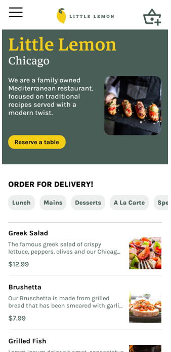

# Solution: Booking a table on the Little Lemon website

The following screens are possible solutions and the design proposed may vary. However, they do need to contain the required elements described for each screen.

## Screen 1: Home screen

This screen was provided to you as a Figma file in your assignment.

Your solution needs to link the Reserve a table button to your next screen.

## Screen 2: Table reservation screen

This screen needs to feature:

* An element to input the date
* An element to input the time 
* An element to input the number of diners
* A button to link to the next screen

The look and feel of the Little Lemon restaurant brand as per the style guide provided.

## Screen 3: Customer details screen

This screen needs to capture the customer details:

* Customer’s first and last name
* Contact information such as phone or email
* Indicate required fields
* A button to confirm or submit the customer information

The look and feel of the Little Lemon restaurant brand as per the style guide provided.

## Scereen 4 (optional): Payment screen (to secure your reservation)

This screen is optional. You can use it as a reference if you created a payment method screen. It should contain the following details:

* Credit card number
* Customer’s first and last name
* Indicate required fields
* Credit card expiration date
* Credit card CVV
* A place to indicate where the customer’s credit card CVV is located
* A button to confirm or submit your reservation

The look and feel of the Little Lemon restaurant brand as per the style guide provided.

